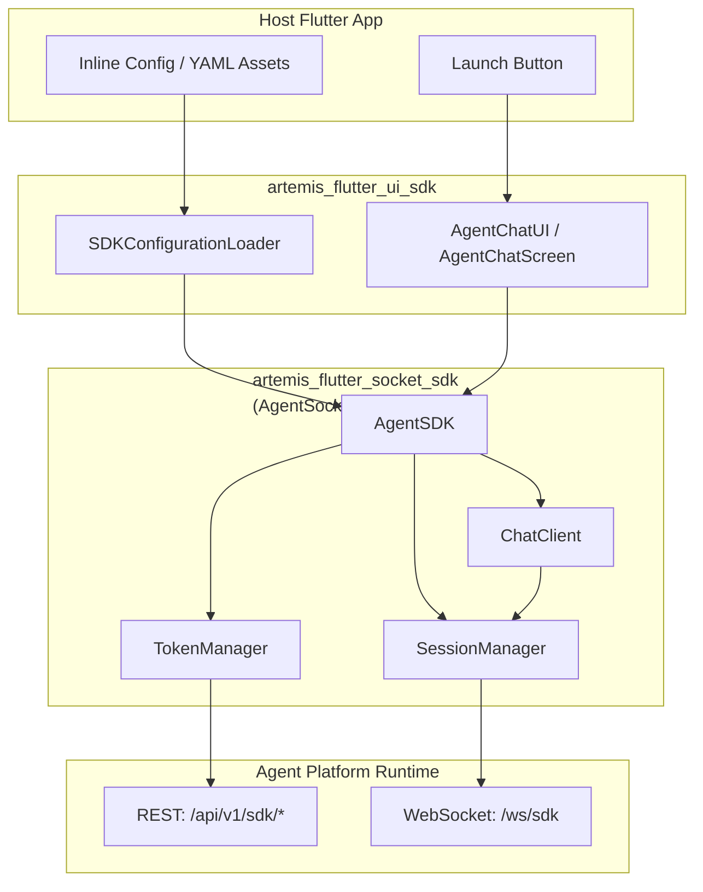

# Artemis Flutter UI SDK — High Level Design (HLD)

**Version:** 0.0.1  
**Last updated:** June 2026  
**Scope:** `artemis_flutter-ui-sdk/` repository (plugin + example app)

---

## 1. Purpose

The Artemis Flutter UI SDK enables iOS and Android applications to embed AI agent chat with minimal integration effort. Host apps configure credentials, tap a button (or call one API), and receive a full chat experience including WebSocket connectivity, message streaming, and Material UI.

The SDK is a **thin presentation and configuration layer** on top of the open-source socket plugin [AgentSocketFlutterPlugin](https://github.com/SudheerJa-Kore/AgentSocketFlutterPlugin) (`artemis_flutter_socket_sdk`), which owns all real-time transport logic.

---

## 2. Goals & Non-Goals

### Goals

| Goal | How it is met |
|------|----------------|
| One-line chat launch | `AgentChatUI.open(context, …)` |
| Programmatic or YAML config | `SDKConfigurationLoader.createDefault()` or assets YAML |
| Production WebSocket stack | Delegated to `artemis_flutter_socket_sdk` |
| iOS & Android | Flutter plugin + Swift/Kotlin stubs |
| Type-safe API | Dart models and events from socket SDK |
| Markdown & rich content | `MarkdownMessage`, `CarouselMessage` widgets |
| Typing feedback | `TypingIndicatorEvent` → animated `TypingIndicatorBubble` |

### Non-Goals (current release)

- Voice / WebRTC (configured but not implemented in UI)
- KPI cards, forms, quick replies (configured but not rendered)
- Offline message queue UI
- Custom host-app chat UI kit (host may use `AgentSDK` directly)

---

## 3. System Context



---

## 4. Logical Architecture

The solution uses a **two-package, three-layer** model:

```
┌─────────────────────────────────────────────────────────────┐
│  Layer 1 — Host Application                                  │
│  • example/lib/main.dart (button + config)                   │
│  • Optional: assets/sdk_configurations.yaml                  │
└──────────────────────────┬──────────────────────────────────┘
                           │
┌──────────────────────────▼──────────────────────────────────┐
│  Layer 2 — artemis_flutter_ui_sdk (this repo)               │
│  • Configuration: SDKConfigurationLoader                     │
│  • UI: AgentChatUI, AgentChatScreen, widgets                 │
│  • Native plugin stubs (iOS / Android)                       │
└──────────────────────────┬──────────────────────────────────┘
                           │ git dependency
┌──────────────────────────▼──────────────────────────────────┐
│  Layer 3 — artemis_flutter_socket_sdk (external)             │
│  • AgentSDK, TokenManager, SessionManager, ChatClient        │
│  • WebSocket via web_socket_channel                          │
│  • HTTP bootstrap via http package                           │
└──────────────────────────┬──────────────────────────────────┘
                           │
┌──────────────────────────▼──────────────────────────────────┐
│  Agent Platform Backend                                      │
│  • Token init/refresh, WS ticket, session, chat frames       │
└─────────────────────────────────────────────────────────────┘
```

---

## 5. Major Components

| Component | Package | Responsibility |
|-----------|---------|----------------|
| `AgentChatUI` | artemis_flutter_ui_sdk | Public entry: navigate to chat screen |
| `AgentChatScreen` | artemis_flutter_ui_sdk | Lifecycle, connect, event → UI binding |
| `SDKConfigurationLoader` | artemis_flutter_ui_sdk | YAML load, validation, `createDefault()` |
| `MessageBubble` | artemis_flutter_ui_sdk | Text, markdown, and carousel rendering |
| `CarouselMessage` | artemis_flutter_ui_sdk | Horizontal rich-content card carousel |
| `TypingIndicatorBubble` | artemis_flutter_ui_sdk | Animated assistant typing indicator |
| `AgentSDK` | artemis (socket) | SDK facade: init, connect, send, events |
| `TokenManager` | artemis | `POST` init/refresh, session token cache |
| `SessionManager` | artemis | WS ticket, connect, reconnect, frames |
| `ChatClient` | artemis | Messages, streaming, history, pending resend |
| Example app | example | Minimal integration reference |

---

## 6. Primary Data Flows

### 6.1 Open Chat (happy path)

1. User taps **Open Chat** in host app.
2. `AgentChatUI.open()` pushes `AgentChatScreen`.
3. Screen builds `SDKConfiguration` (inline or from YAML).
4. `AgentSDK.createWithConfig(config)` is created.
5. `sdk.connect()` → token bootstrap → WS ticket → WebSocket open → `session_start`.
6. UI shows **Connected** status bar; user can send messages.
7. On pop, `sdk.dispose()` tears down subscriptions and socket.

### 6.2 Send Message

1. User types in `ChatInputArea` and taps send.
2. `AgentChatScreen` calls `sdk.sendMessage(text)`.
3. `ChatClient` sends transport frame over `SessionManager`.
4. Server streams chunks / `MessageReceivedEvent`; typing indicator shows while waiting.
5. UI refreshes message list from `sdk.getMessages()`.

### 6.3 Rich Content (Carousel)

1. Assistant message arrives with `richContent.carousel` payload.
2. `MessageBubble` renders text (markdown if enabled) plus `CarouselMessage`.
3. User taps a card; `url_launcher` opens `defaultActionUrl` in external browser.

### 6.4 Reconnect

1. User taps refresh in app bar, or socket SDK auto-reconnects.
2. `SessionManager` reopens WebSocket with backoff (per config).
3. `ChatClient.resendPending()` replays unanswered user messages.
4. Status bar cycles: Connecting → Connected.

---

## 7. Configuration Model

Configuration is **data-driven**. Two supported sources:

| Source | Root YAML key | API |
|--------|---------------|-----|
| Inline (recommended for example) | N/A | `SDKConfigurationLoader.createDefault(...)` |
| Asset file | `artemis_flutter_ui_sdk` or `artemis_sdk` | `SDKConfigurationLoader.load()` |

Required connection fields:

- `project_id`
- `endpoint` (HTTPS)
- `api_key` **or** `bootstrap_token` (exactly one)
- Optional: `channel.channel_id`

Environment overlays: `assets/sdk_configurations.{env}.yaml`

Feature flags relevant to UI rendering:

- `features.enable_markdown` — assistant markdown in bubbles
- `features.enable_carousel` — horizontal card carousel in assistant bubbles
- `chat.enable_typing_indicator` — socket typing events (UI always listens)

---

## 8. Deployment & Integration

### Repository layout

```
artemis_flutter-ui-sdk/
├── artemis_flutter_ui_sdk/   # Publishable plugin (folder name = package name for iOS SPM)
├── example/                  # Reference host app
├── HLD.md                    # This document
├── LLD.md                    # Low-level design
└── README.md                 # Developer quick start
```

### Host app integration (minimal)

```yaml
# pubspec.yaml
dependencies:
  artemis_flutter_ui_sdk:
    path: ../artemis_flutter_ui_sdk
```

```dart
AgentChatUI.open(
  context,
  configuration: SDKConfigurationLoader.createDefault(
    projectId: '…',
    endpoint: 'https://…',
    apiKey: 'pk_…',
    channelId: '…',
  ),
);
```

### Platform notes

- **iOS:** Swift Package Manager symlinks plugin by folder basename `artemis_flutter_ui_sdk` (must match pubspec name).
- **Android:** Kotlin plugin `com.kore.artemis_flutter_ui_sdk`.
- Socket traffic is **pure Dart** (`web_socket_channel`); native plugins only expose `getPlatformVersion`.

---

## 9. Security Considerations

| Topic | Approach |
|-------|----------|
| Credentials | Supplied by host app; never hardcoded in SDK |
| Transport | HTTPS + WSS; ticket-based WS auth |
| Token lifetime | Short-lived; refresh with leeway |
| Production | Enforce TLS in `environment: prod` (validated in loader) |
| External links | Carousel cards open URLs via `url_launcher` in external browser |

---

## 10. Dependencies

| Dependency | Role |
|------------|------|
| [AgentSocketFlutterPlugin](https://github.com/SudheerJa-Kore/AgentSocketFlutterPlugin) | WebSocket, session, chat core |
| `flutter_markdown` | Assistant message rendering |
| `url_launcher` | Carousel card external links |
| `yaml` | Configuration parsing |
| `plugin_platform_interface` | Federated plugin contract |

---

## 11. Future Roadmap

| Feature | Layer |
|---------|-------|
| KPI cards, forms, quick replies | artemis_flutter_ui_sdk UI |
| Voice / WebRTC | artemis socket + platform channels |
| Custom theming API | artemis_flutter_ui_sdk UI |
| Parity with web-sdk templates | artemis_flutter_ui_sdk UI |

---

## 12. Related Documents

- [README.md](./README.md) — Quick start and API summary
- [LLD.md](./LLD.md) — Class-level design, sequences, file map
- [AgentSocketFlutterPlugin](https://github.com/SudheerJa-Kore/AgentSocketFlutterPlugin) — Socket implementation source
