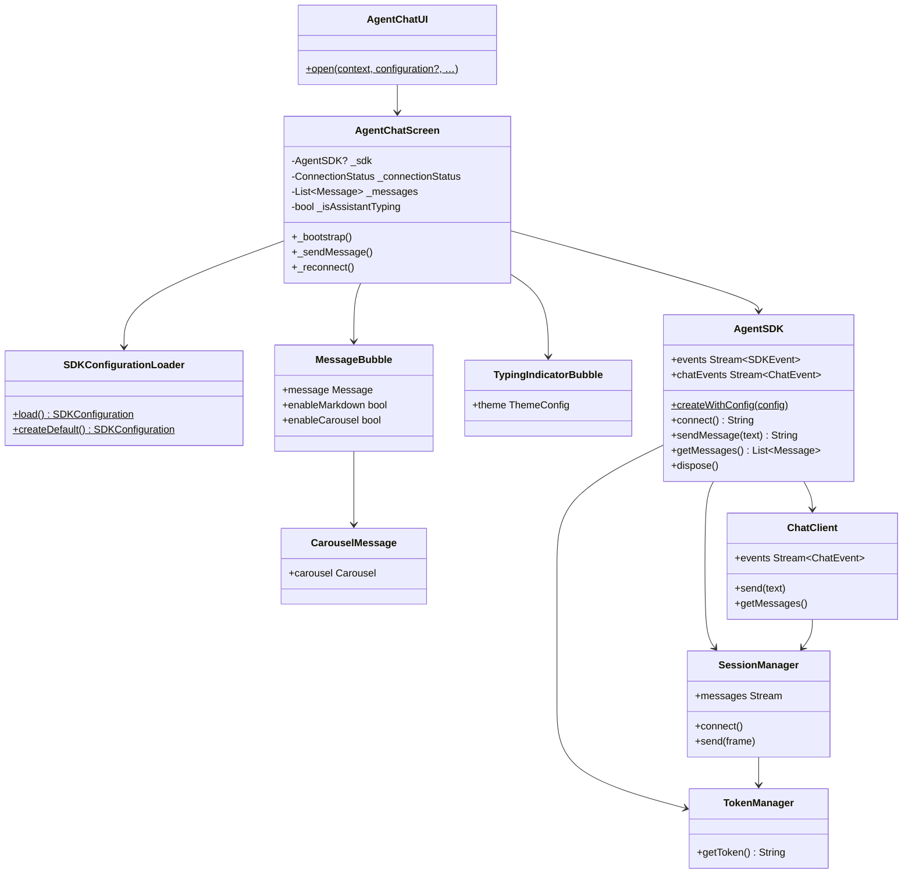
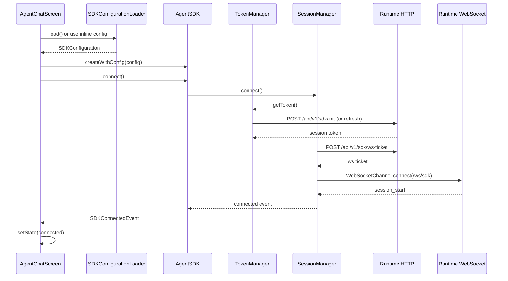
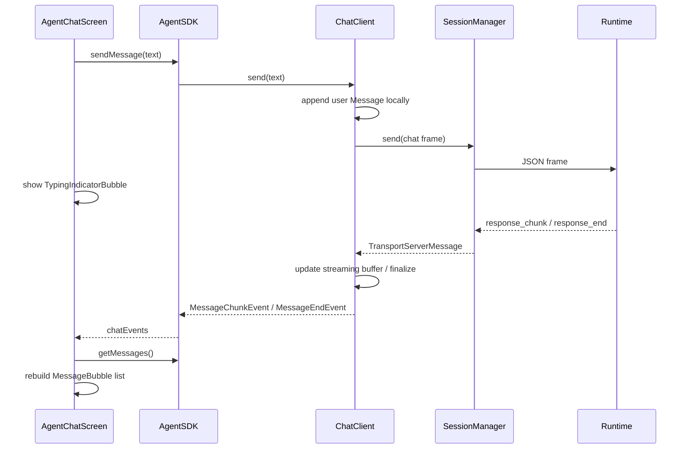
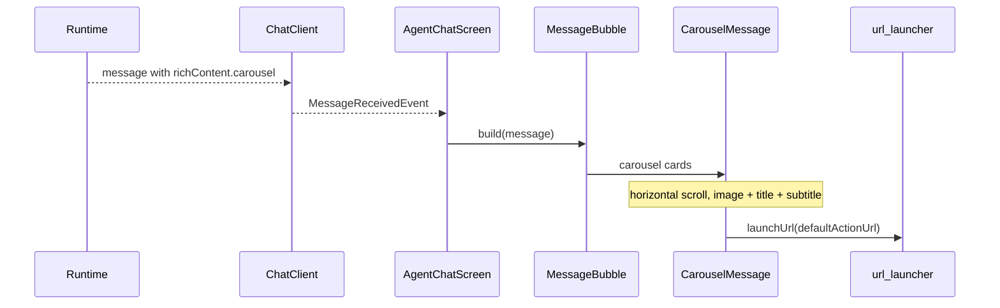

# Artemis Flutter UI SDK — Low Level Design (LLD)

**Version:** 0.0.1  
**Last updated:** June 2026  
**Companion:** [HLD.md](./HLD.md)

---

## 1. Package Structure

### 1.1 `artemis_flutter_ui_sdk`

```
artemis_flutter_ui_sdk/
├── lib/
│   ├── artemis_flutter_ui_sdk.dart          # Public exports
│   ├── artemis_flutter_ui_sdk_platform_interface.dart
│   ├── artemis_flutter_ui_sdk_method_channel.dart
│   └── src/
│       ├── config/
│       │   └── sdk_configuration_loader.dart    # YAML + createDefault()
│       └── ui/
│           ├── agent_chat_ui.dart               # AgentChatUI.open()
│           ├── agent_chat_screen.dart           # Full screen controller
│           ├── connection_status.dart           # UI connection enum
│           ├── theme/
│           │   └── color_utils.dart
│           └── widgets/
│               ├── chat_status_bar.dart
│               ├── chat_empty_state.dart
│               ├── chat_input_area.dart
│               ├── message_bubble.dart
│               ├── markdown_message.dart
│               ├── carousel_message.dart
│               └── typing_indicator_bubble.dart
├── android/ … ArtemisFlutterUiSdkPlugin.kt
├── ios/     … ArtemisFlutterUiSdkPlugin.swift (SPM)
└── test/
```

### 1.2 External: `artemis_flutter_socket_sdk`

Imported via git dependency. Key modules (not duplicated in this repo):

```
lib/src/
├── agent_sdk.dart
├── config/sdk_configuration.dart
├── config/sdk_configuration_loader.dart   # hidden; use artemis_flutter_ui_sdk loader
├── core/
│   ├── token_manager.dart
│   ├── session_manager.dart
│   ├── endpoint.dart
│   ├── websocket_auth.dart
│   ├── sdk_error.dart
│   └── sdk_session_scope.dart
├── chat/chat_client.dart
├── events/sdk_events.dart
├── events/chat_events.dart
├── models/message.dart
├── models/widget_config.dart
├── transport/transport_types.dart
└── utils/logger.dart
```

---

## 2. Public API Surface

### 2.1 Re-exported from `artemis_flutter_socket_sdk`

| Symbol | Kind | Description |
|--------|------|-------------|
| `AgentSDK` | Class | Core SDK instance |
| `SDKConfiguration` | Class | Full config model |
| `ConnectionConfig`, `ChannelConfig`, … | Classes | Config sections |
| `Message`, `MessageRole` | Classes | Chat message model |
| `SDKEvent`, `ChatEvent` | Sealed / classes | Event hierarchy |
| `SDKConnectedEvent`, `MessageReceivedEvent`, … | Classes | Concrete events |
| `ArtemisLogger` | Class | Debug logging |

**Hidden:** `SDKConfigurationLoader` from artemis (replaced by artemis_flutter_ui_sdk loader).

### 2.2 Defined in `artemis_flutter_ui_sdk`

| Symbol | Kind | Description |
|--------|------|-------------|
| `AgentChatUI` | Class | `open()`, `demoApp()` |
| `AgentChatScreen` | Widget | Full-screen chat |
| `SDKConfigurationLoader` | Class | `load()`, `createDefault()` |
| `SDKConfigurationException` | Class | Config errors |
| `ConnectionStatus` | Enum | UI: notConnected / connecting / connected |

---

## 3. Class Relationships



---

## 4. Sequence Diagrams

### 4.1 Bootstrap & Connect



### 4.2 Send User Message



### 4.3 Rich Content Carousel



---

## 5. UI Module Detail

### 5.1 `AgentChatUI.open`

```dart
Navigator.push → AgentChatScreen(
  configuration: …,
  environment: …,
  configAssetPath: …,
  runtimeUserContext: …,
  title: …,
)
```

### 5.2 `AgentChatScreen` state machine

| State | UI |
|-------|-----|
| `notConnected` | Orange status bar; input disabled |
| `connecting` | Blue status bar + spinner; input disabled |
| `connected` | Green status bar; input enabled |

**Additional UI state:**

| Flag | UI |
|------|-----|
| `_isAssistantTyping` | Appends `TypingIndicatorBubble` below message list |
| `_initError` | Red error text below status bar |

**Lifecycle:**

| Phase | Action |
|-------|--------|
| `initState` | `_bootstrap()` |
| `_bootstrap` | Load config → `createWithConfig` → `connect` → subscribe events |
| `dispose` | Cancel subscriptions, dispose controllers, `sdk.dispose()` |

**Chat events handled:**

| Event | Action |
|-------|--------|
| `MessageReceivedEvent` | Refresh messages; dismiss typing on assistant message |
| `MessageStartEvent` / `MessageChunkEvent` / `MessageEndEvent` | Refresh messages |
| `TypingIndicatorEvent` | Set `_isAssistantTyping` from `event.isTyping` |
| `ChatErrorEvent` | Dismiss typing; show snackbar |
| `SDKConnectedEvent` | Set connected |
| `SDKReconnectingEvent` | Set connecting |
| `SDKDisconnectedEvent` | Set not connected; show snackbar |
| `SDKErrorEvent` | Show snackbar |

### 5.3 Widget responsibilities

| Widget | File | Role |
|--------|------|------|
| `ChatStatusBar` | `chat_status_bar.dart` | Connection indicator strip |
| `ChatEmptyState` | `chat_empty_state.dart` | Placeholder when no messages |
| `MessageBubble` | `message_bubble.dart` | User/assistant bubble; markdown and carousel |
| `MarkdownMessage` | `markdown_message.dart` | `flutter_markdown` rendering |
| `CarouselMessage` | `carousel_message.dart` | Horizontal card carousel; opens URLs |
| `TypingIndicatorBubble` | `typing_indicator_bubble.dart` | Animated three-dot typing indicator |
| `ChatInputArea` | `chat_input_area.dart` | TextField + send FAB |

### 5.4 Theming

- Host `ThemeData` applies globally.
- `AgentChatScreen` overrides `ColorScheme` seed from `config.theme.primaryColor` via `colorFromHex()`.
- Bubble border radius from `config.theme.borderRadius`.
- Markdown gated by `config.features.enableMarkdown`.
- Carousel gated by `config.features.enableCarousel` and presence of `message.richContent.carousel`.

---

## 6. Configuration Loader (`SDKConfigurationLoader`)

### 6.1 `createDefault`

Builds a dev-ready `SDKConfiguration` with sensible defaults for all sections. Extended parameters:

```dart
static SDKConfiguration createDefault({
  required String projectId,
  required String endpoint,
  String? apiKey,
  String? channelId,
  String? channelName,
});
```

### 6.2 `load`

1. Read `assets/sdk_configurations.yaml` (or `customPath`).
2. Optionally merge `assets/sdk_configurations.{env}.yaml`.
3. Parse root key `artemis_flutter_ui_sdk` **or** `artemis_sdk`.
4. `SDKConfiguration.fromMap()` (artemis model).
5. Validate required fields; throw `SDKConfigurationException` on failure.

### 6.3 Validation rules (subset)

- `project_id` non-empty
- `endpoint` starts with `http://` or `https://`
- Exactly one of `api_key` / `bootstrap_token`
- `prod` environment must use HTTPS endpoint

---

## 7. Socket Layer (artemis — reference)

> Implementation: [AgentSocketFlutterPlugin](https://github.com/SudheerJa-Kore/AgentSocketFlutterPlugin)

### 7.1 `TokenManager`

| Step | Endpoint | Purpose |
|------|----------|---------|
| Init | `POST {endpoint}/api/v1/sdk/init` | First session token |
| Refresh | `POST {endpoint}/api/v1/sdk/refresh` | Renew before expiry |

Caches token with expiry leeway (`_refreshLeewayMs = 60s`). Stores `SDKSessionScope` and optional `WidgetConfig`.

### 7.2 `SessionManager`

| Concern | Implementation |
|---------|----------------|
| WS URL | `{wsEndpoint}/ws/sdk` |
| Auth | Ticket subprotocol via `POST /api/v1/sdk/ws-ticket` |
| Ready gate | Waits for `session_start` (10s timeout) |
| Reconnect | Exponential backoff per `websocket.reconnection` config |
| Send | JSON-serialized `TransportClientMessage` |
| Receive | Parsed `TransportServerMessage` → broadcast stream |

### 7.3 `ChatClient`

| Concern | Behavior |
|---------|----------|
| Local history | In-memory `List<Message>` |
| Streaming | `_streamingBuffers` per message id |
| Pending resend | `_inFlight` queue on disconnect |
| History hydrate | HTTP fetch on connect (configurable pages) |
| Custom data | `updateCustomData()` merged into outbound frames |
| Rich content | `Message.richContent` populated from server payloads |

### 7.4 Error codes (`SDKErrorCode`)

| Code | Stage |
|------|-------|
| `tokenInit` / `tokenRefresh` | HTTP bootstrap |
| `wsTicket` | WS ticket request |
| `socketConnection` | WebSocket open/error |
| `sessionStart` | Timeout waiting for `session_start` |
| `sendFailed` | Outbound while disconnected |
| `historyFetch` | History hydration failure |

---

## 8. Native Plugin Layer

Both `artemis_flutter_ui_sdk` and `artemis_flutter_socket_sdk` register platform plugins. Method channel: `artemis_flutter_ui_sdk`.

| Method | Android | iOS |
|--------|---------|-----|
| `getPlatformVersion` | Returns Android release | Returns iOS version |

No native socket code — all networking in Dart.

---

## 9. Example Application

**File:** `example/lib/main.dart`

```
MaterialApp → HomeScreen → ElevatedButton
  → AgentChatUI.open(context, configuration: createDefault(…))
```

Credentials are set inline in the example (not in SDK). For production, use secure storage or remote config — never commit secrets.

**Tests:** `example/test/widget_test.dart` — config model, `AgentSDK.createWithConfig`, `Message` JSON, and `SDKUserContext` smoke tests.

---

## 10. Build & SPM Constraint

Flutter iOS SPM symlinks plugins using the **directory basename**. The plugin must live at:

```
artemis_flutter-ui-sdk/artemis_flutter_ui_sdk/   ← folder name == pubspec name
```

Example dependency path (from `example/`):

```yaml
artemis_flutter_ui_sdk:
  path: ../artemis_flutter_ui_sdk
```

Mismatch (e.g. folder `artemis_flutter-ui-sdk` with package `artemis_flutter_socket_sdk`) causes Xcode error:

```
unable to override package … identity doesn't match override's identity
```

---

## 11. Testing Matrix

| Suite | Location | Coverage |
|-------|----------|----------|
| Plugin unit | `artemis_flutter_ui_sdk/test/` | Method channel, platform interface |
| Example unit | `example/test/` | Config loader, Message JSON, AgentSDK init, SDKUserContext |
| Manual | `example/` on device/simulator | End-to-end chat, carousel, typing |

---

## 12. File → Responsibility Quick Reference

| File | Package | Responsibility |
|------|---------|----------------|
| `artemis_flutter_ui_sdk.dart` | ui sdk | Export barrel |
| `sdk_configuration_loader.dart` | ui sdk | Config load/validate/createDefault |
| `agent_chat_ui.dart` | ui sdk | Navigation helper |
| `agent_chat_screen.dart` | ui sdk | SDK lifecycle + UI composition |
| `message_bubble.dart` | ui sdk | Message layout; delegates markdown/carousel |
| `carousel_message.dart` | ui sdk | Rich content card carousel |
| `typing_indicator_bubble.dart` | ui sdk | Animated typing dots |
| `agent_sdk.dart` | artemis | SDK facade |
| `session_manager.dart` | artemis | WebSocket |
| `token_manager.dart` | artemis | HTTP auth |
| `chat_client.dart` | artemis | Messaging |
| `transport_types.dart` | artemis | Wire protocol types |

---

## 13. Changelog vs. Prior Architecture

| Before | After (current) |
|--------|-----------------|
| Duplicated socket code in artemis_flutter_ui_sdk | Git dependency on AgentSocketFlutterPlugin |
| UI in example only | UI in SDK (`AgentChatUI`) |
| Melos federated packages | Single plugin + example |
| YAML-only init | Inline `createDefault` + YAML |
| Text-only bubbles | Markdown + carousel rich content |
